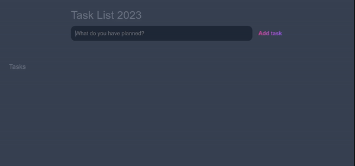

# Task List Uygulaması
- Bu proje, HTML, CSS ve JavaScript kullanılarak oluşturulan bir task list uygulamasıdır. Uygulama, kullanıcılara farklı görevleri eklemelerine ve tamamlamalarına olanak tanır.

### Bu task list uygulaması aşağıdaki özelliklere sahiptir:

- Kullanıcılar;
   - yeni görevler ekleyebilirler
   - görevleri düzenleyebilirler
   - görevleri tamamlayabilir veya tamamlamadıklarını işaretleyebilirler
   - tamamlanmış görevleri silebilirler
   - tüm görevleri veya tamamlanmamış görevleri filtreleyebilirler

#### Önizleme

